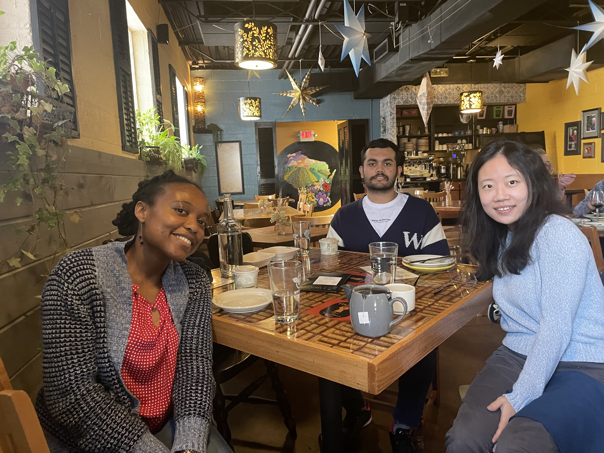

### PhD student
**Raisa Ntemenyi Nkweteyim**  
Research project: Analyzing the All of Us data to assess associations between modifiable risk factors that prohibit access to GLP-1 and impact on diabetes-related outcomes.

### Master Students
**Vishesh Girish Shet**  
Research project: Using Large Language Models to characterize the stages and transition trajectories of an online vaping cessation community using the Stage of Change Theory.  

---
### Group Activities
<figure style="text-align:center;">
  
  <figcaption>Group lunch at La Merenda, April 2026.</figcaption>
</figure>
